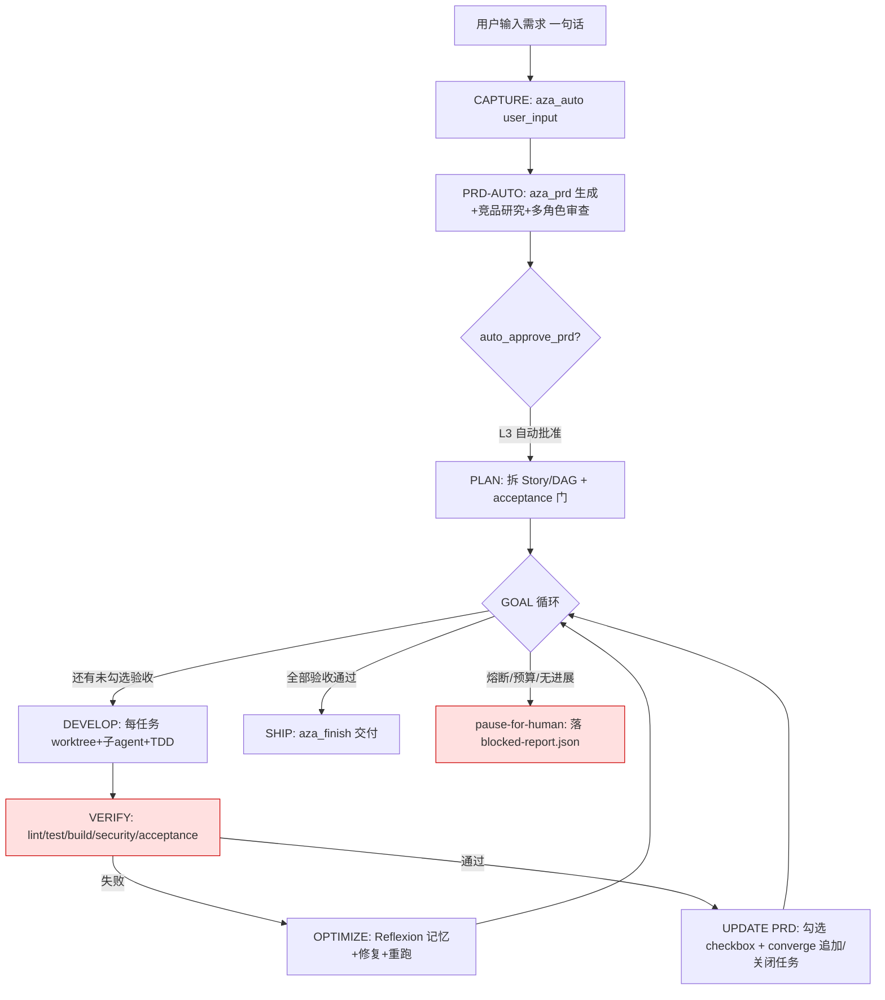

# AzaLoop 重构优化计划 · 「需求 → 100% 自动实现」全自动脊柱

> 日期：2026-07-16
> 依据：18 个参考项目源码实证（见 §2 借用映射）+ 本仓库 `packages/core`、`packages/mcp-server` 源码审计 + `docs/PRD.md`(v0.4.5) + `docs/AUTO-LOOP-NOT-WORKING-FIX-2026-07-16.md`
> 目标：用户在输入框输入需求 → 以需求为目标，**全自动循环执行直到需求全部实现**，中途无需任何用户干预；循环过程中自动优化、自动更新 PRD、自动开始开发
> 原则：宿主 LLM 优先 · 薄 MCP 面（8 工具）· 厚循环内核 · 竞品感知 PRD · 默认合规 · 完成即停（非计数即停）

---

## 0. 目标与非目标

### 0.1 一条铁律（本计划的核心）
**输入即目标，循环即交付。** 用户只需在输入框给出一句需求（"短句也是需求"），之后：
1. 自动生成并**自动批准** PRD（无需人点确认）；
2. 自动拆解 Story/任务，自动开始开发；
3. 循环「开发 → 验证 → 优化」直到**所有验收标准真正通过**；
4. 循环途中**自动更新 PRD**（追加/关闭任务、记录偏离），而非一次性写完就锁死；
5. 全程**零人工干预**，仅在「安全硬闸 / 预算熔断 / 无法收敛」时自动暂停并给出可机器读取的阻塞报告。

### 0.2 非目标
- 不新增 MCP 工具数量（保持 8 工具面；能力沉内核，不膨胀工具面）。
- 不堆 200+ 角色（反对 gstack/agency 的数量竞赛；角色精简、按需组合）。
- 不做人工质量评审的完全取消——**安全扫描与硬闸默认常开**，这是「无人值守」的前提而非束缚。

### 0.3 成功指标（验收）
| 指标 | 验收口径 |
|------|----------|
| 全自动 e2e 绿 | `scripts/e2e-real-loop.ts` + `scripts/verify-spine.ts` 在无人工确认下稳定绿 |
| 零干预 PRD | `auto_approve_prd=true` 时 PRD 生成后直接进入开发，无 `awaitingAction` 卡点 |
| 完成即停 | 循环终止条件为「全部验收标准通过」（OpenSpec `/goal` 式），而非 `max_iterations` 触发 |
| PRD 自更新 | 每轮循环后 PRD checkbox ledger + tasks 自动 append/close（spec-kit `converge` 式） |
| 安全常开 | 每个工具调用前默认过 ShellWard `enforce`（`SHELLWARD_MODE=enforce`） |
| 收敛保障 | `no-progress` / `max-retries` / `budget` 任一触发 → 自动进入 `pause-for-human` 并落 `blocked-report.json` |

---

## 1. 现状审计（为什么现在还做不到「零干预全自动」）

结合 `AUTO-LOOP-NOT-WORKING-FIX` 与 `AzaLoop-18竞品超越方案`，当前已具备 L0–L9 十层架构、8 工具 MCP、三级循环、断路器、跨会话续航，但**全自动脊柱在 T1 客户端仍然会断**。根因清单：

| # | 根因 | 现象 | 本计划对应修复 |
|---|------|------|----------------|
| R1 | `STAGE_TOOL_GROUPS.open` 隐藏了 `aza_loop`/`aza_auto` | 宿主无法执行 `next_action`，停在 open | §4.1 脊柱工具面常量化 |
| R2 | MCP 指向错误仓库，状态写到别的目录 | 进度丢失、误判未开始 | §4.1 MCP 配置 + 路径校验 |
| R3 | design 完成要求 7 张图 / 完整 OpenSpec | design 永不完成，循环空转 | §4.2 Lean design gate |
| R4 | 竞品 URL 子弹变成 FR/story | PRD 垃圾、验收无意义 | §4.2 `isCompetitiveUrlNoise` 过滤 |
| R5 | build checker 在 monorepo 根裸跑 `tsc --noEmit` 失败 | `unit_test_pass_pct=0` → 断路器熔断 | §4.3 改为 `packages/core` + marker 判定 |
| R6 | `autonomy.level` 写入 yaml 但 schema 丢弃、未执法 | L1 仍可能写码、L3 不自动 ship | §4.4 autonomy 执法 |
| R7 | `aza_loop batch` 未接通 `WorktreeManager` | 并行是假隔离 | §5.2 真 git worktree |
| R8 | Process Skills 软强制 | 无 design 也能 implement | §4.5 硬门控 |
| R9 | ShellWard 库存在但 MCP `tools/call` 默认未挂 | 无人值守下危险 shell 无拦截 | §6.1 默认 `enforce` |
| R10 | 循环终止靠 `max_iterations` 而非验收条件 | 容易「跑满但没做完」或「没做完就停」 | §3.2 完成条件驱动 |

---

## 2. 18 项目「机制借用映射」（证据驱动）

> 每个项目只抽**最该抄的一条可落地机制**，落地动作指向本仓库模块。

| # | 项目 | 抽出的核心机制（实证） | 落到 AzaLoop 的哪一层 / 文件 |
|---|------|------------------------|------------------------------|
| 1 | **planning-with-files** | 3 文件规划法（`task_plan.md`/`findings.md`/`progress.md`）+ **Stop-hook 终止门**（所有 checkbox 完成才允许停）+ 每轮重读 plan | L2 记忆 + L7 循环：`progress.md` 风格落盘；`stage-tool-guard` 增加「完成门」 |
| 2 | **spec-kit** | `converge` = 规格 vs 代码库差距评估，**自动 append 任务到 tasks.md**；`ensure_within()` 路径收敛 | L1：`prd-review-gate` 增加 `converge` 步骤；`spec-kit` 路径安全→`security` 路径校验 |
| 3 | **OpenSpec** | `/goal` **条件驱动循环**（达成可验证完成条件才停，而非计数）；`runbook.md`；slice roadmap 自动勾选；parity-hash + deletion-ledger | L7：`aza_loop` 增加 `action=goal`；完成判定用 acceptance 而非迭代次数 |
| 4 | **ralphy-openspec** | 同 prompt 重复投喂自纠正 + `BUDGET.md`/`state.db` 超时熔断 + 每任务 git worktree | L7 循环 + L8：`BUDGET.md` 预算熔断；`WorktreeManager` 每任务隔离 |
| 5 | **ralphy** | **PRD.md checkbox ledger 即循环驱动器**；`--max-iterations`/`--max-retries` 熔断；`parallel_group` 真 worktree；自动 merge | L7：`task-board` 以 checkbox 为状态；`CircuitBreaker` 补 retries；`aza_loop batch` |
| 6 | **loop-engineering** | 成熟断路器 + **显式升级 `exit 2`** + 咨询式 worktree 锁 + 人类门 + **Loop-Ready 审计分**（CI≥58）；`loop-cost` | L7：`CircuitBreaker` 加 `escalate`；新增 `loop_ready` 评分（`aza_meta`）；`LoopCost` |
| 7 | **superpowers** | `worktree-per-task` + `subagent-driven-development`（每原子任务一个干净子 agent）+ 两阶段审查 | L8：`WorktreeManager` + `dynamic-binder` 子代理分发 |
| 8 | **gstack** | **fail-closed 断路器** + 双模型范围变更门（变更先给人确认不静默采纳）；提示注入分类器(WARN .75/BLOCK .92) | L6：`stage-tool-guard` fail-closed；`L4 Input Auditor` 注入分类 |
| 9 | **agency-orchestrator** | `ao compose` 把一句话**自动生成 PRD→DAG**，每步带 `acceptance` 门；`concurrency` + 验收门 | L7：`DAGBuilder` acceptance 锚定；`aza_loop batch` 自动组 DAG |
| 10 | **ruflo** | **AI 成本保险丝** `RUFLO_AI_BUDGET` + 签名 kill-switch（24h 吊销 TTL）；Ed25519 witness 签名 | L7：`CostTracker` + `budget` 熔断；配置签名校验 |
| 11 | **Trellis** | append-only `events.jsonl` 通道运行时（supervisor+adapter 阻塞等待）；递归守卫防同名家重生成 | L7：`RunLedger` 改为 append-only 事件流；`recursion guard` |
| 12 | **comet** | **可恢复 5 阶段状态机**（open→design→build→verify→archive）+ `.comet.yaml` 阶段跟踪 + `state-events.jsonl` 审计 + 硬阻塞阶段守卫；`auto_transition` | L7：`AutoLoopEngine` 阶段机 + `STATUS.md`；`auto_transition` 默认开 |
| 13 | **claude-skills** | `SKILL.md` + `references/` 标准技能目录结构；**问答式 PRD 采集**模板 | L1：`prd-generator` 问答采集；L5 技能目录规范化 |
| 14 | **agent-skills** | **`/build auto`**（一次批准→自主跑到完）+ **Anti-rationalization 反合理化表** + eval 回归门禁 + spec-before-code | L5：process-skills 硬门控 + `rationalization` 拦截；`aza_quality` eval 门 |
| 15 | **superpowers-zh** | `always_on` bootstrap **强制** `brainstorming→plan→TDD→verify` 不可跳过链；手动/自动技能分离 | L5：`constitution.md` always_on 注入；强制链门控 |
| 16 | **ai-coding-guide** | `task-decomposition` 大需求拆小任务 + `scenarios.md` 端到端脚本模板 | L1：`prd-generator` 拆任务粒度模板 |
| 17 | **shellward** | **8 层防御** + `SHELLWARD_MODE=enforce` 默认阻断 + **rug-pull 基线指纹**（`mcp-baseline.json`） | L6：MCP `tools/call` 默认过 ShellWard；MCP 描述变更报警 |

> 注：原 18 名单中的 `andrej-karpathy-skills-12` 已在 `AzaLoop-18竞品超越方案` 中并入（Fail Loud / Checkpoint / Token Budgets），其子项（Token Budget 硬上限）纳入 §5.3。

---

## 3. 目标架构：Requirement → Done 全自动脊柱

### 3.1 生命周期（单一事实来源 = PRD checkbox ledger）

> **图意：** 整条链路除「安全硬闸 / 预算熔断 / 无法收敛」外无任何人工节点；PRD 既是输入也是运行中不断被改写的状态机。

### 3.2 完成条件驱动（取代计数驱动）
借鉴 **OpenSpec `/goal`** 与 **ralphy checkbox ledger**：循环终止的唯一正条件是「PRD 中所有 `acceptance_criteria` 状态 = passed」，由 `aza_quality(check)` 在每轮末裁决。`max_iterations` 退化为**兜底保险丝**而非主终止条件。

### 3.3 每轮「自更新 PRD」动作（spec-kit `converge` + ralphy ledger）
每轮 VERIFY 后，`aza_prd(evolve)` 自动：
1. 勾选本轮已 passed 的 acceptance；
2. 用 `converge` 比对「当前代码库 vs PRD 声明」，把新发现的缺口 append 为新的 `REQ-/TASK-`；
3. 把偏离（scope creep / 技术债）写进 `deletion-ledger` 风格的 `CHANGELOG.aza`；
4. 重写 `STATUS.md` 进度（借鉴 comet `.comet.yaml` + planning-with-files `progress.md`）。

---

## 4. 分期实施计划

### Phase 0 — 脊柱稳定（P0，必须先行，~3–5 天）
目标：先让「全自动能跑通不中断」，再谈增强。

| ID | 任务 | 文件/命令 | 验收 |
|----|------|-----------|------|
| P0.1 | 脊柱工具面常量：每阶段含 `aza_loop`/`aza_auto`，`listTools` 默认全量 | `packages/core/src/L7_loop/stage-tool-groups-spine.ts` | T1 客户端不再停在 open |
| P0.2 | MCP 配置指向本仓库 + `AZA_AUTO_APPROVE_PRD=true` + 启动路径校验 | `azaloop.yaml` + `mcp-server` 启动；新增 `resolveWorkspaceRoot()` | 状态写入正确目录 |
| P0.3 | Lean design gate：`.aza/design.md` + `## Technical Approach` 即算完成 | `packages/core/src/L1_spec/design-gate.ts` | design 不再要求 7 图 |
| P0.4 | PRD 竞品 URL 噪声过滤 | `isCompetitiveUrlNoise()` 接 `prd-generator` | URL 不再变成 FR/story |
| P0.5 | Build checker 改为 `packages/core` + `build-complete.marker`/OpenSpec tasks 全勾即 100% | `packages/core/src/L7_loop/build-checker.ts` | tsc 失败不再误熔断 |
| P0.6 | 跑通回归 | `pnpm test:spine`；`npx tsx scripts/e2e-real-loop.ts`；`npx tsx scripts/verify-spine.ts` | 全绿，日志入 `docs/verification/` |

**借鉴：** loop-engineering「先能跑再升级自治」；karpathy「Fail Loud / Checkpoint」。

### Phase 1 — 自治正确性（P1，~1–2 周）
目标：让「零干预 + 完成即停 + PRD 自更新」真正成立。

| ID | 任务 | 借鉴 | 文件/命令 | 验收 |
|----|------|------|-----------|------|
| P1.1 | `autonomy.level` 写入 schema 并**执法**：L1 禁写码、L3 允许 auto ship | loop-engineering | `azaloop.yaml` schema + `autonomy-enforcer.ts` | L3 下无 `awaitingAction` |
| P1.2 | Process Skills **硬门控**：无 design 不得 implement；无 quality 不得 ship | superpowers / agent-skills | `L5_skill/process-skills-gate.ts` + `constitution.md` | 跳过即被拦截 |
| P1.3 | 完成条件驱动：`aza_loop action=goal`，acceptance 全 passed 才停 | OpenSpec `/goal` | `L7_loop/goal-loop.ts` | 跑满计数前已完成则停 |
| P1.4 | PRD 自更新 `aza_prd(evolve)` + `converge` 差距追加 | spec-kit | `L1_spec/prd-evolve.ts` + `converge.ts` | 每轮后 PRD ledger 变化 |
| P1.5 | opt-in `gated` 模式 + `task_plan.md` **SHA-256 认证防篡改** | planning-with-files | `L7_loop/attestation.ts` | 计划被改即告警 |
| P1.6 | 4 角色审查补 Design 角色（CEO/Eng/Design/QA） | gstack | `L1_spec/prd-multi-role-review.ts` | 审查报告含 Design |
| P1.7 | Loop Readiness Score 产品化：`aza_meta loop_ready --suggest` | loop-engineering | `L7_loop/loop-ready.ts` | meta 输出 0–100 + 改进列表 |
| P1.8 | Token Budget 硬上限（karpathy Rule 6） | karpathy-12 | `L7_loop/CostTracker` + `azaloop.yaml` | 超预算熔断 |

### Phase 2 — 规模化与安全常开（P2，~2–3 周）
目标：并行、可恢复、合规默认开。

| ID | 任务 | 借鉴 | 文件/命令 | 验收 |
|----|------|------|-----------|------|
| P2.1 | `aza_loop batch` **接通 `WorktreeManager`**，真 `git worktree` 隔离 | ralphy / superpowers | `L8_orchestrator/worktree/manager.ts` | worktree=true 真实隔离 |
| P2.2 | batch 验收门进 `batch-report`（concurrency + acceptance） | agency-orchestrator | `L7_loop/BatchRunner.ts` | 单次 ≥2 story 汇总报告 |
| P2.3 | ShellWard **默认 `enforce`** 挂 MCP `tools/call` 前 | shellward | `L6_security/shellward-pre-tool.ts` | 危险 payload 被拒 |
| P2.4 | 提示注入分类器（WARN .75 / BLOCK .92）fail-closed | gstack | `L6_security/injection-classifier.ts` | 注入被拦 |
| P2.5 | rug-pull 基线指纹：MCP 工具描述变更即报警 | shellward / ruflo | `mcp-baseline.json` + 校验 | 描述变更告警 |
| P2.6 | 成本保险丝 `AZA_AI_BUDGET` + 签名 kill-switch（24h TTL） | ruflo | `L7_loop/budget-fuse.ts` | 超预算自动 pause |
| P2.7 | 便携包 checksum + CI 合规卡 | spec-kit / shellward | `scripts/pack-ci.ts` | Release 带校验和 |

---

## 5. 关键设计决策（深入）

### 5.1 为什么「完成条件驱动」而不是「计数驱动」
计数驱动（`max_iterations=50`）在两个方向都危险：跑满但没做完 → 交付半成品；没做完就停 → 误报完成。**OpenSpec `/goal`** 与 **ralphy checkbox ledger** 都证明：把"验收标准是否通过"作为唯一终止条件，循环才可靠。`max_iterations` 降级为兜底保险丝（对应 loop-engineering 的 `iteration cap → escalate=exit 2`）。

### 5.2 并行：真 worktree，不是假隔离
当前 `aza_loop batch` 骨架已存在但未调 `WorktreeManager`（R7）。**ralphy** 的 `parallel_group` + 每任务 worktree、**superpowers** 的 `worktree-per-task` 子代理分发，是已验证模式：每个原子任务在独立分支/工作树跑一个干净子 agent，完成后并入主干。**agency-orchestrator** 的 `acceptance` 门保证并行结果可验收。

### 5.3 预算与熔断（无人值守的生命线）
无人工意味着必须有"自己喊停"的能力，三层熔断：
1. **进度熔断**：`no-progress` N 次（借 loop-engineering stalemate）→ `pause-for-human`；
2. **重试熔断**：`max-retries`（借 ralphy）→ 进入修复分支或暂停；
3. **成本熔断**：`AZA_AI_BUDGET`（借 ruflo）→ 签名 kill-switch 24h TTL 自动吊销。

任何熔断都落 `blocked-report.json`（机器可读：原因 / 卡点文件 / 建议动作），供人工或下次会话 `resume` 消费。

### 5.4 安全外壳默认常开
"零干预"≠"零守护"。**shellward 8 层防御** 在 `SHELLWARD_MODE=enforce` 下默认拦截危险 shell / 数据外泄 / 提示注入；MCP 工具描述变更触发 rug-pull 报警（借 shellward `mcp-baseline.json`）。这与 `azaloop.yaml` 的 `hard_stop_on_security: true` 叠加，构成无人值守的底线。

---

## 6. 风险与回滚

| 风险 | 触发 | 缓解 / 回滚 |
|------|------|-------------|
| 全自动误删/误改生产文件 | 路径越权 | `ensure_within()` 路径收敛（spec-kit）+ ShellWard L3 + `hard_stop_on_security` |
| 循环陷入伪完成（自认为做完实际没） | 验收标准写得太松 | acceptance 必须可机器验证（借 OpenSpec verifiable completion）；`aza_quality` eval 门（agent-skills） |
| 预算失控 | 长任务 / 模型重试风暴 | `AZA_AI_BUDGET` 熔断 + 成本日志 |
| 竞品研究把 URL 当需求 | PRD 噪声 | `isCompetitiveUrlNoise` 已落地，保持 |
| 重构引入回归 | 改脊柱 | `pnpm test:spine` + e2e 全绿才合并；保留 `REFACTOR-OPTIMIZATION-PLAN-EXCEED-2026-07-16.md` 旧方案可对照 |

---

## 7. 行动建议（优先级汇总）

- **P0（先做，否则全自动不成立）**：P0.1–P0.6 脊柱稳定 + 跑通 e2e。
- **P1（让"零干预 + 完成即停 + PRD 自更新"成立）**：autonomy 执法、Process Skills 硬门控、goal 循环、PRD evolve/converge、gated+attestation、4 角色、Loop Ready、Token Budget。
- **P2（规模化与合规常开）**：真 worktree 并行、ShellWard 默认 enforce、注入分类、rug-pull 基线、成本保险丝、便携 CI。

> 一句话：**先用 loop-engineering 的方式让脊柱跑起来，再用 OpenSpec `/goal` + ralphy ledger 让循环"做完才停且边做边改 PRD"，最后用 shellward + ruflo 预算给无人值守上保险。**

---

## 8. 信息来源
- 18 项目 README 实证（2026-07-16，3 个并行研究 agent 抓取）：planning-with-files / spec-kit / OpenSpec / ralphy-openspec / ralphy / loop-engineering / superpowers / gstack / agency-orchestrator / ruflo / Trellis / comet / claude-skills / agent-skills / superpowers-zh / ai-coding-guide / shellward
- 本仓库源码审计：`packages/core/src/L0_platform` `L1_spec` `L5_skill` `L6_security` `L7_loop` `L8_orchestrator`
- `docs/PRD.md`(v0.4.5) · `docs/AUTO-LOOP-NOT-WORKING-FIX-2026-07-16.md` · `docs/competitive-analysis/AzaLoop-18竞品超越方案-2026-07-16.md`
- 融资金额 / 市场份额等：**未公开**，未编造。
