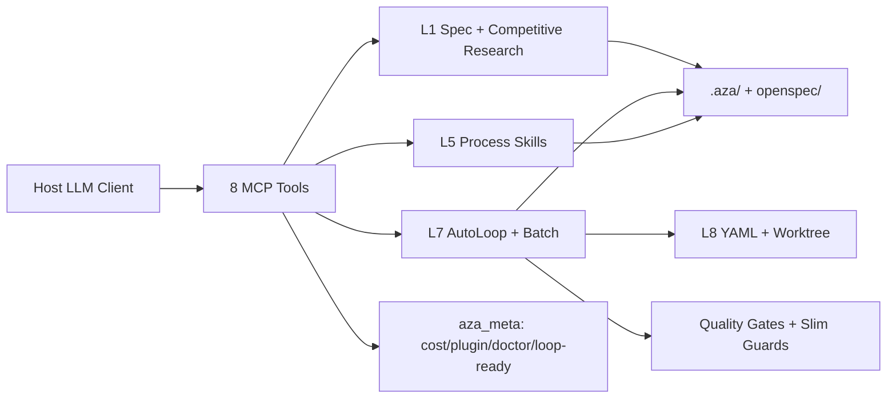

# AzaLoop 重构优化计划（路径 B · 能力层重构）

> **日期：** 2026-07-16  
> **依据：** [`docs/competitive-analysis/AzaLoop-竞品分析报告-2026-07-16.md`](./competitive-analysis/AzaLoop-竞品分析报告-2026-07-16.md)  
> **策略：** 保持 **8 个 MCP 工具**与 L0–L9 分层不变；按竞品共性补齐五条能力带  
> **周期：** 约 4–6 周（含 Week 0 收尾）  
> **原则：** DRY · YAGNI · 证据先于宣称 · Spec before code  

---

## 0. 目标与非目标

### 目标
1. 主线全自动路径在 T1 客户端 **不被守卫误拦**（绝不死循环，也不误中断）。
2. 具备 **多任务批量并行**（`aza_loop batch` + worktree / parallel_group）。
3. Process Skills 与角色 Slash **产品化**（强制流程，不膨胀工具面）。
4. 引入 **Loop Ready + L1→L3 自治等级**，让成本与风险可控可见。
5. 持续放大 **GitHub 竞品搜索入 PRD** 差异化卖点。

### 非目标
- 不拆 monorepo 为多独立产品（路径 C 延后）。
- 不把 MCP 工具数扩到 30+。
- 不复制 gstack/agency 的「200+ 角色」堆量。

### 成功指标
| 指标 | 验收 |
|------|------|
| T1 e2e | `scripts/e2e-real-loop.ts` + `verify-spine.ts` 稳定绿 |
| Batch | 单次提交 ≥2 个独立 story，worktree 隔离，汇总报告落盘 |
| Skills | brainstorm→plan→tdd→verify 在 build 阶段可被 aza_meta/skills 强制命中 |
| Loop Ready | `aza meta` 或 CLI 输出 0–100 分 + 改进建议 |
| 竞品章节 | 每次 L2+ PRD review 的 `prd.md` 含 `## Competitive Research` |

---

## 1. 目标架构（保持 8-tool）



| MCP 工具 | 本计划新增动作（不新增工具名） |
|----------|-------------------------------|
| `aza_session` | calibrate 时注入 Loop Ready 摘要 |
| `aza_prd` | 已有竞品章节；补 explore 轻量模式 |
| `aza_loop` | **新增 `action=batch`** |
| `aza_spec` | 对齐 OpenSpec archive 提示 |
| `aza_quality` | auto 模式 red-flags 仅记录 |
| `aza_finish` | 学完回写 conventions（已有则强化） |
| `aza_meta` | **loop_ready / autonomy / workers 文档查询** |
| （其余） | 保持 |

---

## 2. 五条能力带 ↔ 竞品映射

| 能力带 | 主要借鉴 | 落点模块 |
|--------|----------|----------|
| A. Spec 流体化 | OpenSpec opsx、Trellis、comet | `L1_spec/*`、`.aza/`、openspec change |
| B. Process Skills | superpowers、agent-skills、karpathy-12 | `L5_skill/core-skills/*`、constitution |
| C. 角色 Slash | gstack、agency（精简版） | `templates/clients/cursor/commands/*` |
| D. 并行批量 | ralphy、agency-orchestrator | `L7_loop` + `L8_orchestrator/worktree` |
| E. 循环工程 | loop-engineering、planning-with-files | circuit-breaker、Loop Ready、自治等级 |

---

## 3. 分期计划

### Week 0 — 收尾与基线（P0，3–5 天）

| ID | 任务 | 文件/命令 | 验收 |
|----|------|-----------|------|
| W0.1 | 守卫调用图文档 + auto 模式策略 | 新增 `docs/architecture/guard-call-graph.md`；调整 `red-flags.ts` / `stage-tool-guard.ts` | auto：red-flags 不阻断写；硬闸仍生效 |
| W0.2 | 跑通回归 | `pnpm test:spine`；`npx tsx scripts/e2e-real-loop.ts`；`npx tsx scripts/verify-spine.ts` | 全绿，记录日志到 `docs/verification/` |
| W0.3 | Worker 触发/落点表 | `docs/architecture/workers-matrix.md` | 每个 worker：触发条件、产物路径、是否默认启用 |
| W0.4 | README 卖点强化 | `README.md` / `README.en.md` | 首页明示「PRD 自动 GitHub 竞品研究」 |

**借鉴：** loop-engineering「先能跑再升级自治」；karpathy「Fail Loud / Checkpoint」。

---

### Week 1–2 — Spec + Skills + 角色（P1）

#### 1.1 Spec 流体 UX（OpenSpec / Trellis / comet）

| 步骤 | 内容 |
|------|------|
| 1 | `aza_prd` 增加轻量 `explore` 子语义（或文档约定 `/aza-design`）：只读代码、出选项，不写 change |
| 2 | change 生命周期对齐：propose → apply → archive；archive 时更新 `openspec/specs` 与 `.aza` 索引 |
| 3 | 按复杂度分级：L1 跳过 live 竞品搜索与多角色评审（已有部分逻辑则补测试） |

**关键路径：**  
`packages/core/src/L1_spec/prd-review-gate.ts`  
`packages/core/src/L1_spec/change-folder.ts`  
`packages/core/src/L1_spec/github-competitive-research.ts`

#### 1.2 Process Skills 强制链（superpowers / agent-skills）

| Skill | when_to_use | 门控 |
|-------|-------------|------|
| brainstorming | 新功能/方案选择前 | 无 design 不得进入 build（已有 PRD gate，补 design 文档门） |
| writing-plans | design 批准后 | `task_plan.md` 必须含可勾选任务 |
| tdd-process | 任意生产代码 | verify 阶段 TDD Iron Law |
| verification-before-completion | 宣称完成前 | 必须先过 `aza_quality` |

**关键路径：** `packages/core/src/L5_skill/core-skills/*`、`constitution.md` 注入。

#### 1.3 角色 Slash 精简产品化（gstack）

映射现有 Cursor commands，不新增 MCP：

| 命令 | 角色意图 | 底层 |
|------|----------|------|
| `/aza-ceo` | 战略挑战范围 | 多角色 CEO review |
| `/aza-cso` | 安全审计 | L6 scanners |
| `/aza-qa` | 验收/浏览器 QA 清单 | gate5 + ui-qa |
| `/aza-review` | 双轨审查 | Maker/Checker |
| `/aza-ship` | 发布清单 | aza_finish |

**验收：** `docs/clients/cursor.md` 有一张「命令→能力」表；T1 客户端模板同步。

---

### Week 3–4 — 并行批量（P1 核心缺口）

#### 2.1 `aza_loop action=batch`

**契约（草案）：**

```yaml
# .aza/batch.yaml
concurrency: 3
isolation: worktree  # or sandbox
base_branch: main
items:
  - id: auth
    prd: .aza/prd-auth.md
    parallel_group: 1
  - id: dashboard
    prd: .aza/prd-dashboard.md
    parallel_group: 1
  - id: billing
    prd: .aza/prd-billing.md
    parallel_group: 2
```

**行为：**
1. 按 `parallel_group` 分批；同组并行，组间串行。  
2. 每项独立 worktree + `.aza/runs/<id>/` 状态。  
3. 共享竞品缓存（24h）与质量门阈值。  
4. 结束后写 `.aza/batch-report.md`；可选 `--create-pr`。  

**关键路径：**  
- 新增：`packages/core/src/L7_loop/batch-runner.ts`  
- 复用：`L8_orchestrator/worktree/manager.ts`、`yaml-orchestrator.ts`  
- MCP：`packages/mcp-server/src/tools/aza-loop.ts` + `unified-handlers.ts`  
- CLI：`aza batch .aza/batch.yaml`

**借鉴：** ralphy `--parallel` + `parallel_group`；agency `concurrency`；ralphy sandbox 作为大仓备选。

#### 2.2 Maker / Checker 双轨（superpowers）

内循环每个 story：implementer → reviewer（spec 合规 → 代码质量）。已有雏形则补：失败不进下一 story、审查上限 3 次。

---

### Week 5 — 循环工程与 Token（P1/P2）

#### 3.1 Loop Ready 评分（loop-engineering）

`aza_meta action=loop_ready` 输出类似：

| 维度 | 权重 | 检查 |
|------|------|------|
| Spec 制品 | 20 | prd.md / openspec change 存在 |
| State 脊柱 | 20 | STATE.yaml + RESUME.md |
| Budget | 15 | budget 配置 / cost tracker |
| Guards | 15 | circuit + hard-stop 启用 |
| Skills | 15 | 核心 process skills 已注册 |
| Verify | 15 | quality gates 可运行 |

总分 0–100 + `--suggest` 改进列表。

#### 3.2 自治等级 L1→L3

| 等级 | 行为 | 默认场景 |
|------|------|----------|
| L1 | 只报告 / 草稿 PRD / 不写业务代码 | 首周接入 |
| L2 | 可改代码，需人批准 ship | 默认 |
| L3 | 无人值守（`AZA_AUTO_APPROVE_PRD` + auto ship 白名单） | T1 全自动 |

配置：`azaloop.yaml` → `autonomy.level`。

#### 3.3 断路器错误签名（loop-engineering）

在 `circuit-breaker.ts`：对错误消息归一化哈希；同签名连续 N 次 → 熔断并写入 STATUS；避免无效重试烧 token。

#### 3.4 阶段化上下文（Trellis）

`context-orchestrator.ts`：按 stage 只注入成功产物摘要；失败栈折叠；跨会话用 Resume 摘要而非全量回灌。

---

### Week 6 — 合规与分发（P2）

| 任务 | 借鉴 | 落点 |
|------|------|------|
| CI 合规扫描卡片 | shellward | `aza_quality` / GitHub Action 可选 job |
| 便携包 checksum + 复现说明 | spec-kit bundles | `scripts/build-portable.ts` + `docs/PORTABLE.md` |
| 客户端文档对标 | ai-coding-guide | 抽查 T1 四客户端文档一致性 |

---

## 4. 文件变更总表（预期）

| 操作 | 路径 |
|------|------|
| 修改 | `packages/core/src/L7_loop/circuit-breaker.ts` |
| 修改 | `packages/core/src/L7_loop/red-flags.ts`、`stage-tool-guard.ts` |
| 新增 | `packages/core/src/L7_loop/batch-runner.ts` |
| 修改 | `packages/core/src/L8_orchestrator/worktree/manager.ts` |
| 修改 | `packages/core/src/L2_memory/context-orchestrator.ts` |
| 修改 | `packages/mcp-server/src/tools/aza-loop.ts`、`unified-handlers.ts`、`tool-registry.ts` |
| 修改 | `packages/core/src/L5_skill/core-skills/*` |
| 修改 | `templates/clients/cursor/commands/*`、`docs/clients/*.md` |
| 新增 | `docs/architecture/guard-call-graph.md`、`workers-matrix.md` |
| 新增 | `docs/verification/2026-07-*-spine.md` |
| 修改 | `README.md`、`azaloop.yaml` |

---

## 5. 测试与验证矩阵

| 层级 | 命令 | 覆盖 |
|------|------|------|
| 单测 | `pnpm test:spine` | board / completion-gate / makers / prd-depth |
| 竞品 | `npx tsx scripts/smoke-competitive.mts` | 竞品章节 / 缓存 |
| E2E | `npx tsx scripts/e2e-real-loop.ts` | 单 PRD 全自动 |
| Batch | 新增 `tests/unit/batch-runner.test.ts` + 集成脚本 | parallel_group 顺序 |
| 守卫 | 新增用例：auto 模式下合法 write 不被 red-flags 拦 | W0.1 |
| 便携 | `pnpm build:portable` | zip 产出 |

---

## 6. 风险与回滚

| 风险 | 缓解 |
|------|------|
| Batch 合并冲突 | 默认 `--create-pr`；自动合并可关 |
| 守卫放宽导致漏拦 | 仅 auto 模式放宽 red-flags；安全类 hard-stop 不变 |
| Skills 强制过严卡住小改 | L1 自治 + 复杂度矩阵跳过 brainstorm |
| Token 飙升 | Loop Ready + budget + 错误签名熔断 |

回滚：feature flag `AZA_BATCH=0` / `autonomy.level=L1`；batch 代码可独立开关。

---

## 7. 与既有文档关系

| 文档 | 关系 |
|------|------|
| `analysis/flow-review-and-optimization.md` | 技术债与 7/14 已落地项；本计划承接其 §11.3 未做项 |
| `docs/OPTIMIZATION-PLAN-0.1.0.md` | 0.1.0 基线；本计划为下一里程碑 |
| `docs/competitive-analysis/*-2026-07-14.md` | 历史稿；以 **2026-07-16** 报告为准 |
| `docs/PROJECT-PLAN-V12.md` | 产品路线；本计划是其「能力层重构」切片 |

---

## 8. 执行选择（给实施者）

计划就绪后可选：

1. **Subagent-Driven（推荐）** — 每任务新子代理 + 两阶段审查（对齐 superpowers）  
2. **Inline** — 本会话按 Week 顺序推进，每 Week 设检查点  

**建议从 Week 0.1（守卫回归）开始。**

---

## 附录 A — 竞品细节→任务速查

| 竞品细节 | 本计划任务 |
|----------|-----------|
| planning-with-files gated Stop / Session Recovery | W0 守卫 + STATE/RESUME 校验 |
| spec-kit presets/bundles | Week 6 便携包校验 |
| gstack /autoplan /cso /qa | Week 1–2 角色 Slash |
| OpenSpec explore/propose/archive | Week 1 Spec 流体 |
| loop-engineering circuit + L1–L3 + Loop Ready | Week 5 |
| karpathy 12 rules | 写入 constitution 短契约补充 |
| superpowers subagent TDD | Week 1 Skills + Week 3 Maker/Checker |
| ralphy-openspec STATUS/BUDGET/CONTEXT | batch 每 run 目录对齐 |
| ralphy parallel_group / sandbox | Week 3–4 batch |
| ruflo ReasoningBank | P3 延后 |
| Trellis phase inject / learn-from-task | Week 5 上下文 + finish 回写 |
| comet stage guard / resume-probe | W0 守卫分层 |
| claude-skills PRD 交互 | 已有 aza_prd；文档对齐 |
| agent-skills /build auto | 对齐 auto_approve 全链路 |
| superpowers-zh | i18n 技能文案可选 |
| agency concurrency / acceptance | batch + gate5 |
| ai-coding-guide | 客户端文档 |
| shellward scan/CI | Week 6 |

## 附录 B — 已完成（勿重复做）

来自 2026-07-14 执行记录：

- ✅ `runCompetitiveResearch()` 统一入口 + prd 竞品章节  
- ✅ 删除 `generateAsync`  
- ✅ aza_meta 接入 cost / plugin / test_loop  
- ✅ 竞品 24h 缓存与 L1 curated / L2+ live  

本计划 **从守卫回归与 batch 开始**，不再重做竞品搜索主路径。
