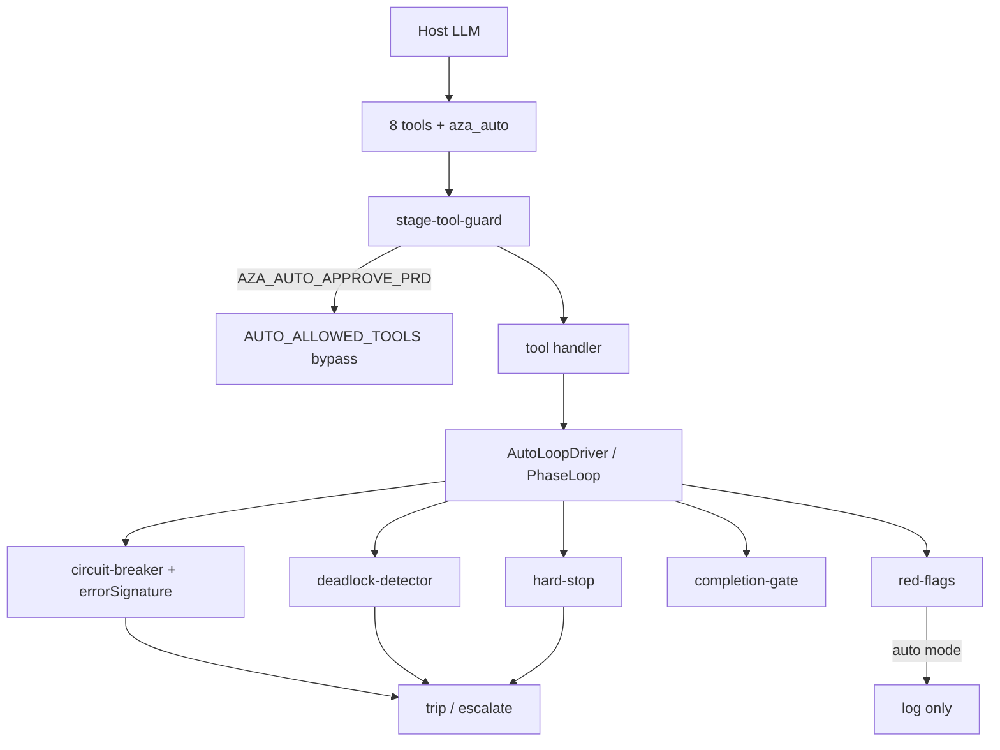

# Guard call graph (full-auto)

> 2026-07-16 — documents which guards can block the T1 auto path.

## Auto mode policy

| Guard | Auto (`AZA_AUTO_APPROVE_PRD=true`) | Manual |
|-------|-------------------------------------|--------|
| stage-tool-guard | Bypass for prd/spec/finish/loop/quality/auto | Matrix |
| red-flags | Prefer log (`autoMode: log`) | May block |
| circuit-breaker | Hard stop on signature repeat / budget | Same |
| deadlock-detector | Hard stop | Same |
| hard-stop | Security / max iter | Same |
| completion-gate | Required for ship | Same |

## Design stage complete when

1. OpenSpec change has proposal + design (`## Technical Approach`) + tasks, **or**
2. `.aza/design.md` has `## Technical Approach` and length ≥ 80, **or**
3. `.aza/design.md` + ≥7 diagrams (legacy)

Do **not** require 7 diagrams for full-auto.
