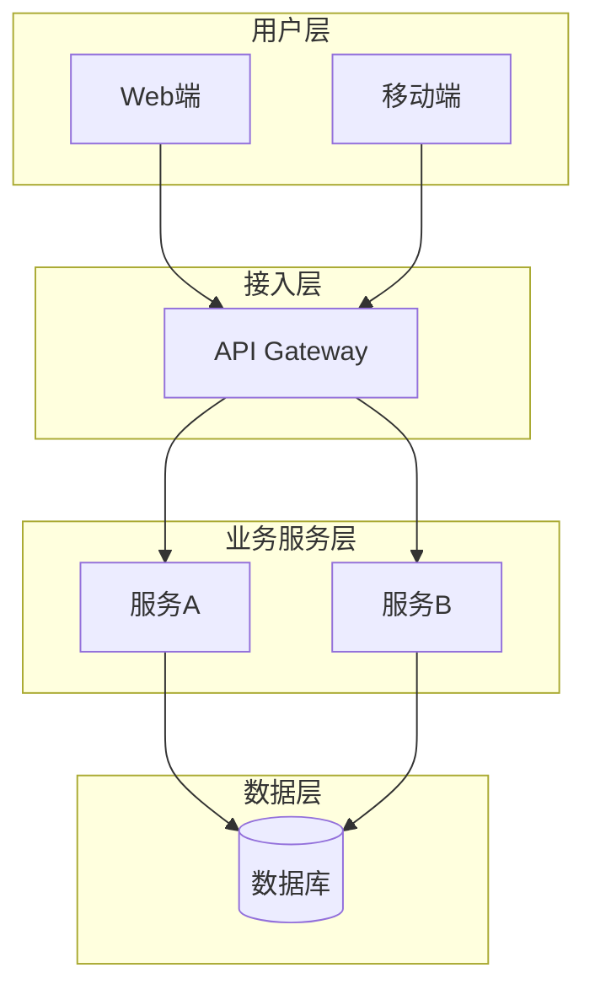
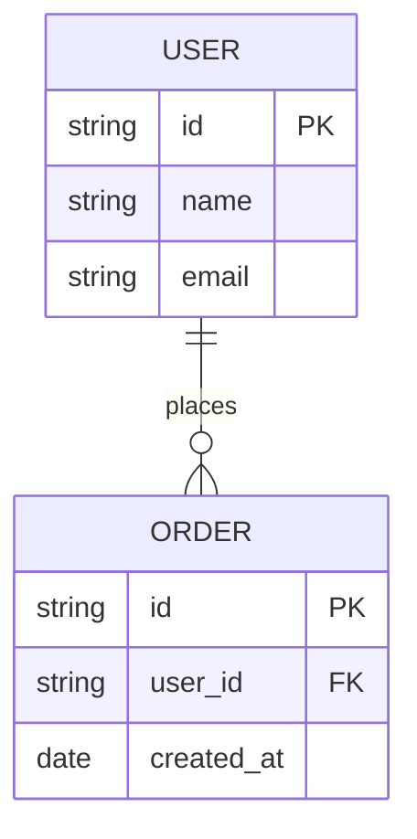
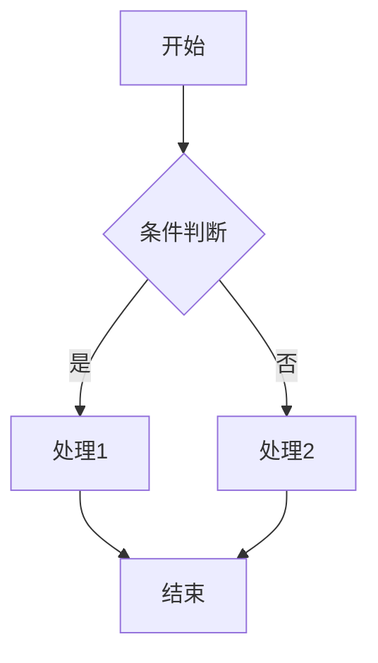
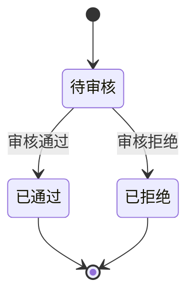

# 14 章节 PRD 详细生成指引

> 借鉴 create-prd-skill 的章节生成指引，结合 AzaLoop 的 PRD Schema。
> 每章节包含：目标、生成结构、生成规则、质量标准。

## 第 1 章：项目背景

### 章节目标
用清晰、有数据支撑的语言描述项目的来龙去脉，让阅读者理解项目为什么要做。

### 生成结构
```markdown
## 1. 项目背景

### 1.1 业务现状
{描述当前业务运行状况：组织架构、核心业务流程、现有系统/工具、关键业务数据}

### 1.2 面临问题
{列出当前面临的核心问题，按优先级排序：}
1. **{问题1标题}**：{具体描述，尽量附带数据}
2. **{问题2标题}**：{具体描述}

### 1.3 解决思路
{概述本项目的解决方向和核心策略}

### 1.4 决策依据
{列出支持本项目立项的关键数据和事实}
```

### 生成规则
- **信息充足时**：从用户描述中提取组织背景、业务模式、现有系统
- **信息不足时**：基于产品类型生成框架性描述，用 `[TODO]` 标注
- **产品类型差异化**：
  - 商业化产品：侧重市场机会、客户痛点、商业价值假设
  - 企业自研系统：侧重业务现状（带数据）、效率瓶颈、管理层诉求

### 质量标准
- [ ] 背景描述有具体的业务场景，不空泛
- [ ] 问题描述有优先级排序
- [ ] 解决思路与问题一一对应
- [ ] 有数据支撑（即使是粗略数据）

---

## 第 2 章：需求基本情况

### 章节目标
用结构化方式记录需求的基本信息，确保需求的来源、对象、场景、价值都清晰可追溯。

### 生成结构
```markdown
## 2. 需求基本情况

| 要素 | 内容 |
|------|------|
| **需求提出人** | {从上下文推断或标注 [TODO]} |
| **功能使用人** | {列出主要使用角色} |
| **受影响人** | {列出虽不直接使用但受影响的角色} |
| **场景描述** | 见下方详细场景 |
| **发生频率** | {日均/周均/月均频次} |
| **核心痛点** | {一句话概括解决的是谁的什么痛点} |
| **需求价值** | {对业务的具体价值} |

### 核心场景描述
**场景1：{场景标题}**
- **人物**：{角色名称}，{角色背景}
- **时间**：{典型发生时间}
- **地点**：{线上/线下，具体场景}
- **起因**：{触发这个需求的事件}
- **经过**：{当前的处理过程}
- **结果**：{当前结果及其问题}
```

### 质量标准
- [ ] 三类角色（提出人/使用人/受影响人）都已识别
- [ ] 至少有1个核心场景用六要素完整描述
- [ ] 痛点描述具体，不是"提升效率"这类空话
- [ ] 频率和价值有估算

---

## 第 3 章：商业分析

### 章节目标
从商业视角分析产品的市场空间、竞争格局和差异化定位。

### 生成结构（商业化产品）
```markdown
## 3. 商业分析

### 3.1 目标市场与客户分析
| 分析维度 | 内容 |
|----------|------|
| **目标市场** | {产品针对什么行业、什么市场} |
| **市场规模** | {TAM/SAM/SOM 估算，含数据来源} |
| **客户画像** | {目标客户的典型特征} |
| **客户痛点** | {目标客户群体的核心痛点} |

### 3.2 竞品分析
| 分析维度 | 竞品A | 竞品B | 我方产品 |
|----------|-------|-------|----------|
| **商业模式** | | | |
| **目标客户** | | | |
| **核心功能** | | | |
| **优势** | | | |
| **劣势** | | | |

### 3.3 差异化定位
{基于以上分析，阐述本产品的差异化竞争策略}
```

### 生成结构（企业自研系统）
```markdown
## 3. 业务分析与系统调研

### 3.1 同类系统调研
| 调研对象 | 类型 | 核心能力 | 可借鉴点 | 局限性 |
|----------|------|----------|----------|--------|
| {内部现有系统A} | 内部 | | | |
| {外部参考系统B} | 外部 | | | |

### 3.2 业务痛点优先级
| 排序 | 痛点描述 | 影响范围 | 严重程度 | 紧迫度 |
|------|----------|----------|----------|--------|
| 1 | | | | |

### 3.3 投入产出初步评估
| 维度 | 估算 |
|------|------|
| **预计投入** | {人力、时间、预算概估} |
| **效率提升** | {预计节省的工时/降低的错误率} |
```

---

## 第 4 章：项目收益目标

### 生成结构
```markdown
## 4. 项目收益目标

### 4.1 商业目标（商业化产品）
| 指标 | 目标值 | 说明 |
|------|--------|------|
| **营收目标** | {年度/季度} | |
| **客户数** | {目标客户数} | |
| **续费率** | {目标续费率} | |
| **NPS** | {目标 NPS 值} | |

### 4.2 效率目标（企业自研系统）
| 指标 | 当前值 | 目标值 | 提升幅度 |
|------|--------|--------|----------|
| **处理时长** | {当前} | {目标} | {提升%} |
| **错误率** | {当前} | {目标} | {降低%} |

### 4.3 产品目标
| 指标 | 目标值 | 说明 |
|------|--------|------|
| **功能使用率** | {目标%} | |
| **用户活跃度** | {DAU/MAU} | |
```

---

## 第 5 章：项目方案概述

### 生成结构
```markdown
## 5. 项目方案概述

### 5.1 整体方案
{概述整体解决方案，包括核心模块、技术选型、架构设计}

### 5.2 技术选型
| 技术栈 | 选型 | 理由 |
|--------|------|------|
| **前端** | {React/Vue/...} | {理由} |
| **后端** | {Node.js/Java/...} | {理由} |
| **数据库** | {PostgreSQL/MySQL/...} | {理由} |

### 5.3 里程碑
| 阶段 | 时间 | 交付物 |
|------|------|--------|
| **MVP** | {时间} | {核心功能} |
| **V1.0** | {时间} | {完整功能} |
```

---

## 第 6 章：项目范围

### 生成结构
```markdown
## 6. 项目范围

### 6.1 功能边界
| 功能模块 | 是否包含 | 说明 |
|----------|----------|------|
| **模块A** | ✅ 包含 | {说明} |
| **模块B** | ❌ 不包含 | {理由} |

### 6.2 非功能需求
| 类别 | 要求 |
|------|------|
| **性能** | {响应时间 < 500ms} |
| **可用性** | {99.9%} |
| **安全性** | {数据加密、权限控制} |

### 6.3 排除项
{明确列出本项目不包含的功能或范围}
```

---

## 第 7 章：项目风险

### 生成结构
```markdown
## 7. 项目风险

| 风险描述 | 概率 | 影响 | 应对策略 |
|----------|------|------|----------|
| **风险1** | 高/中/低 | 高/中/低 | {缓解措施} |
| **风险2** | 高/中/低 | 高/中/低 | {缓解措施} |
```

### 质量标准
- [ ] 每个风险都有概率和影响评估
- [ ] 高风险必须有应对策略
- [ ] 风险覆盖技术、业务、资源三个维度

---

## 第 8-9 章：术语与参考文献

### 生成结构
```markdown
## 8. 术语定义

| 术语 | 定义 |
|------|------|
| **术语1** | {定义} |

## 9. 参考文献
- {参考文档1}
- {参考文档2}
```

---

## 第 10 章：功能需求（核心章节）

### 生成结构
```markdown
## 10. 功能需求

### 10.1 产品框架概述

#### 系统架构图


#### 数据模型（ER图）


#### 业务流程图


#### 状态机图


### 10.2 产品需求详解

#### 模块A：{模块名称}

**功能描述**：{详细描述}

**业务规则**：
1. {规则1}
2. {规则2}

**页面交互**：
- {交互1}
- {交互2}

**异常处理**：
- {异常场景1}：{处理方式}
- {异常场景2}：{处理方式}

### 10.3 异常情况处理方案
| 异常场景 | 处理方式 | 用户提示 |
|----------|----------|----------|
| **网络错误** | {重试/降级} | {提示文案} |
| **数据校验失败** | {返回错误} | {提示文案} |
```

### 质量标准
- [ ] 架构图包含用户层、接入层、业务层、数据层
- [ ] ER图包含所有核心实体和关系
- [ ] 流程图覆盖主流程和关键分支
- [ ] 状态机覆盖正常和异常路径
- [ ] 每个模块都有业务规则、页面交互、异常处理

---

## 第 11 章：数据埋点

### 生成结构
```markdown
## 11. 数据埋点

### 11.1 核心指标
| 指标名称 | 计算方式 | 目标值 |
|----------|----------|--------|
| **DAU** | {日活跃用户数} | {目标} |
| **转化率** | {注册/访问} | {目标%} |

### 11.2 埋点清单
| 事件名称 | 触发时机 | 参数 |
|----------|----------|------|
| **page_view** | 页面加载 | {page_id, user_id} |
| **button_click** | 按钮点击 | {button_id, page_id} |
```

---

## 第 12 章：角色和权限

### 生成结构
```markdown
## 12. 角色和权限

### 12.1 角色定义
| 角色 | 职责 | 权限范围 |
|------|------|----------|
| **管理员** | {系统管理} | {全部权限} |
| **普通用户** | {业务操作} | {基础权限} |

### 12.2 权限矩阵
| 功能 | 管理员 | 普通用户 | 访客 |
|------|--------|----------|------|
| **查看数据** | ✅ | ✅ | ✅ |
| **编辑数据** | ✅ | ✅ | ❌ |
| **删除数据** | ✅ | ❌ | ❌ |
| **系统设置** | ✅ | ❌ | ❌ |
```

---

## 第 13 章：运营计划

### 生成结构
```markdown
## 13. 运营计划

### 13.1 上线推广（商业化产品）
| 阶段 | 策略 | 目标 |
|------|------|------|
| **种子期** | {邀请制} | {100个种子用户} |
| **增长期** | {付费推广} | {1000个用户} |

### 13.2 内部推广（企业自研系统）
| 阶段 | 策略 | 目标 |
|------|------|------|
| **试点期** | {选择试点部门} | {验证效果} |
| **推广期** | {培训+推广} | {全公司覆盖} |

### 13.3 监控指标
| 指标 | 监控频率 | 告警阈值 |
|------|----------|----------|
| **系统可用性** | 实时 | < 99.9% |
| **错误率** | 每小时 | > 1% |
```

---

## 第 14 章：待决事项

### 生成结构
```markdown
## 14. 待决事项

| 事项 | 负责人 | 截止日期 | 状态 |
|------|--------|----------|------|
| **待确认需求1** | {负责人} | {日期} | 待确认 |
| **待确认需求2** | {负责人} | {日期} | 待确认 |
```

### 质量标准
- [ ] 所有 [TODO] 标记都已汇总到此章节
- [ ] 每个待决事项都有负责人和截止日期
