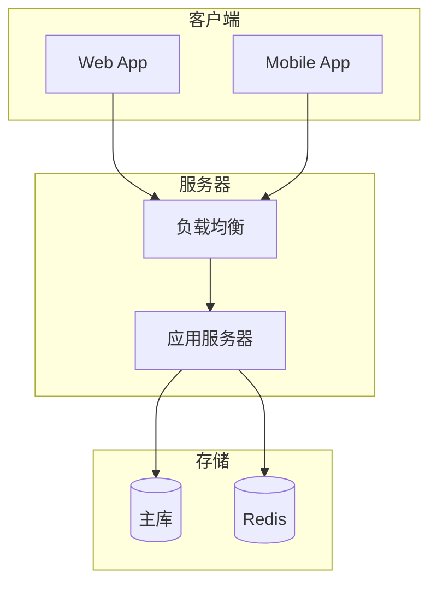

# 架构图模板

## 系统架构图
```mermaid
graph TD
    subgraph "{{layer1_name}}"
        A1[{{component1}}]
        A2[{{component2}}]
    end
    subgraph "{{layer2_name}}"
        B1[{{component3}}]
        B2[{{component4}}]
    end
    A1 --> B1
    A2 --> B2
```

## 数据流图
```mermaid
flowchart LR
    User[用户] -->|{{input}}| API[API Gateway]
    API --> Service[服务层]
    Service --> DB[(数据库)]
    Service --> Cache[(缓存)]
```

## 部署架构图

